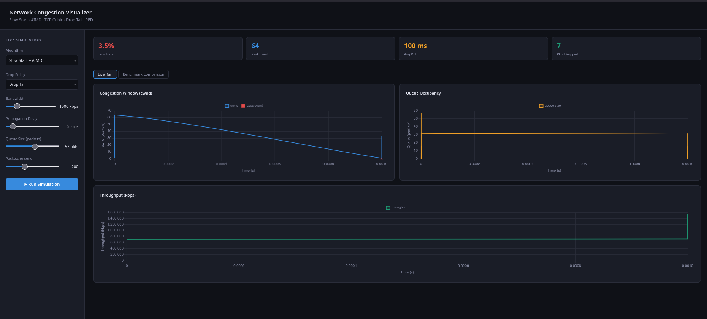
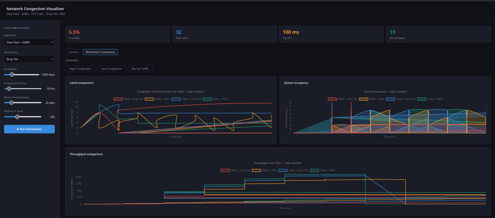
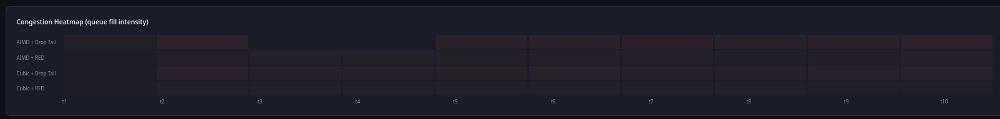
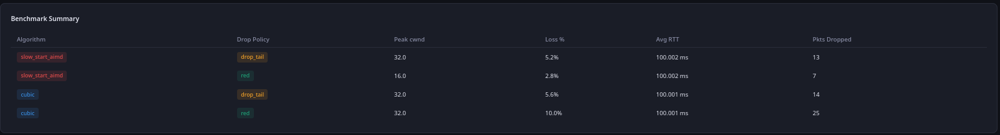

# 🚀 Network Congestion Visualizer

An interactive simulation and visualization tool for understanding TCP congestion control algorithms and queue management techniques.

---

## 📊 Overview

This project simulates real-world network congestion behavior and provides a modern dashboard to visualize:

- Congestion window (cwnd)
- Queue occupancy
- Throughput
- Packet loss
- Benchmark comparisons across algorithms

---

## 🔥 Features

### 🧪 Live Simulation
- Real-time simulation of TCP behavior
- Adjustable parameters:
  - Bandwidth
  - Propagation delay
  - Queue size
  - Packets sent

### ⚡ Supported Algorithms
- Slow Start + AIMD
- TCP Cubic

### 📦 Queue Policies
- Drop Tail
- RED (Random Early Detection)

### 📈 Benchmark Comparison
- Compare all algorithm + policy combinations
- Visualize:
  - cwnd growth
  - Queue dynamics
  - Throughput performance
- Heatmap for congestion intensity
- Summary table with metrics

---

## 🧠 Concepts Covered

- TCP Congestion Control
- Additive Increase Multiplicative Decrease (AIMD)
- Congestion Window (cwnd)
- Queue Management (Drop Tail, RED)
- Throughput & Packet Loss Analysis

---

## 🖼️ Screenshots

### 📊 Live Simulation


### 📈 Benchmark Comparison


### 🔥 Heatmap


### 📋 Summary Table


---

## 🛠️ Tech Stack

- **Backend:** Python (Flask)
- **Frontend:** HTML, CSS, JavaScript
- **Visualization:** Chart.js
- **Simulation:** Custom TCP congestion models

---

## 📁 Project Structure
network-congestion-visualizer/
│
├── dashboard/ # Frontend (UI + charts)
├── sim/ # Simulation logic (TCP, Router, Sender)
├── benchmarks/ # Benchmark runner + CSV results
├── main.py # Entry point
├── requirements.txt
└── README.md


---

## ▶️ Run Locally

```bash
git clone https://github.com/vivekkk06/network-congestion-visualizer.git
cd network-congestion-visualizer

# Create virtual environment
python -m venv venv
source venv/bin/activate

# Install dependencies
pip install -r requirements.txt

# Run dashboard
python main.py --dashboard


Benchmark Mode

To generate benchmark data:

python -m benchmarks.run_all

Author
VIVEK BADGUJAR

